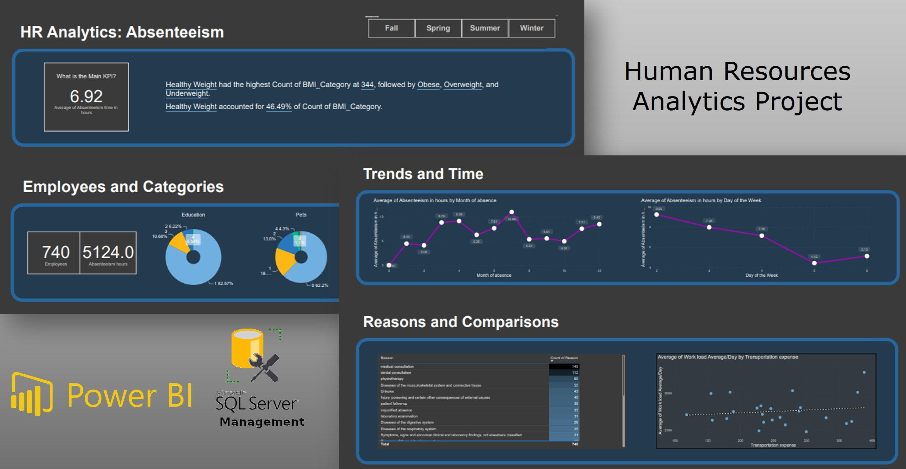

# Proyecto de Análisis de Datos para Incentivos y Bienestar de Empleados

## Introducción

Bienvenido al Proyecto de Análisis de Datos para Incentivos y Bienestar de Empleados. En este proyecto, te guiaré a través del proceso de utilizar análisis de datos para impulsar incentivos a empleados y promover el bienestar en el lugar de trabajo. El objetivo principal es identificar a individuos saludables y proporcionarles incentivos adecuados, al mismo tiempo que desarrollamos un panel informativo para visualizar tendencias de ausentismo. Este proyecto abarca análisis de datos, creación de una base de datos SQL, desarrollo de consultas SQL y la creación de un panel Power BI.

## Descripción del Proyecto

### Tareas del Proyecto

- **Construir una Base de Datos**: Comenzamos creando una base de datos SQL para almacenar y gestionar los datos necesarios. Esta base de datos consolidará información de dos archivos CSV: "Absentism.csv" y "Reason.csv".

- **Desarrollar Consultas SQL**: Crearemos consultas SQL para analizar los datos, filtrar a los trabajadores saludables y calcular aumentos salariales para los no fumadores.

- **Realizar Análisis**: Identificaremos a los individuos más saludables según criterios específicos, como no fumadores, no bebedores y un Índice de Masa Corporal (IMC) saludable. También calcularemos aumentos salariales para los no fumadores.

- **Conectar la Base de Datos a Power BI**: Para crear visualizaciones significativas, conectaremos la base de datos SQL a Power BI.

- **Construir un Dashboard**: El proyecto incluye el diseño de un panel de acuerdo con un wireframe proporcionado por el departamento de Salud. El panel mostrará indicadores clave de rendimiento, una vista general, desgloses de datos específicos y filtros para personalización.

### Solicitud de Recursos Humanos

El departamento de Recursos Humanos ha realizado las siguientes solicitudes:

1. **Incentivos para Empleados Saludables**: Proporcionar una lista de individuos saludables con bajo ausentismo para el Programa de Bonificación Saludable, con un presupuesto total de $1,000.

2. **Calcular el Aumento de Compensación**: Calcular el aumento salarial o compensación anual para los no fumadores utilizando un presupuesto de seguros de $983,221. El objetivo es proporcionar un bono adicional de $1,000 a los empleados más saludables.

3. **Crear un Panel**: Desarrollar un panel para que Recursos Humanos comprenda las tendencias de ausentismo en el trabajo, basándose en el boceto aprobado.

### Herramientas Utilizadas

#### Microsoft SQL Server Studio 19

Utilizamos Microsoft SQL Server Studio 19 para la gestión de la base de datos y el desarrollo de consultas SQL. Esto es lo que hacemos:

- Creamos una base de datos para almacenar los datos de "Absentism.csv" y "Reason.csv."

- Calculamos el aumento salarial por hora para los no fumadores, lo que resulta en un aumento anual aproximado de $1,414.4 USD.

- Optimizamos las consultas SQL para datos consolidados.

#### POWERBI

Creamos el panel en Power BI basado en el boceto proporcionado por el departamento de Salud:

- El panel incluye indicadores clave de rendimiento, una vista general, desgloses con datos específicos y filtros para personalización.

- Visualizamos el ausentismo en el trabajo, el número de empleados, sus niveles de educación, el número de hijos que tienen y su clasificación de IMC.

- Mostramos tendencias que muestran cómo varía el ausentismo por mes y día y visualizamos las razones más comunes para el ausentismo.

- El panel se divide en secciones para mayor claridad y facilidad de uso.

## Consultas SQL

Aquí hay un resumen de las consultas SQL utilizadas en este proyecto:

1. **Creación de la Base de Datos**: Creamos una base de datos consolidando datos de "Absentism.csv" y "Reason.csv."

2. **Filtrar Trabajadores Saludables**: Identificamos a los empleados más saludables para el programa de incentivos en función de criterios como no fumar, no beber y un IMC saludable.

3. **Calcular Aumento de Compensación**: Calculamos el aumento de compensación para los no fumadores utilizando un presupuesto específico.

4. **Optimizar Consulta para Datos Consolidados**: Categorizamos a los empleados utilizando declaraciones CASE y optimizamos la consulta para datos consolidados.

## Conclusión

El Proyecto de Análisis de Datos para Incentivos y Bienestar de Empleados es una demostración completa de la toma de decisiones basada en datos. Al identificar y recompensar a los empleados saludables, Recursos Humanos busca promover el bienestar y desalentar malos hábitos. El panel de Power BI proporciona una interfaz amigable para que Recursos Humanos obtenga información sobre las tendencias de ausentismo.

Para obtener el código completo y detalles de implementación, consulta los archivos del repo.
